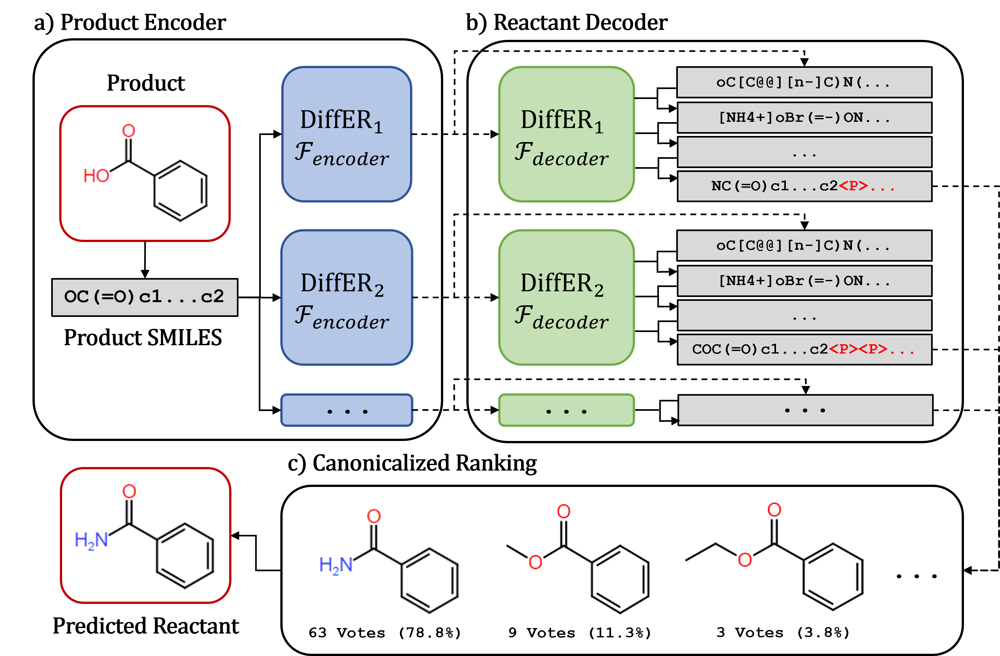

# DiffER: Categorical Diffusion for Chemical Retrosynthesis

This is the working repo for [DiffER, Diffusion Ensembles for Chemical Retrosynthesis](https://openreview.net/forum?id=lrqHtZvSZW), a workshop paper presented at the 2024 NeurIPS Workshop on AI for New Drug Modalities.

As a working repo, code is still liable to change and improve.

## How it works

DiffER works by training a collection of individual categorical diffusion models, each of which utilizes a different distribution of random padding tokens during training to account for variability in the length of the output SMILES string from the length prediction. Notably, 'main.py' is only used to train a single diffusion model! To construct an ensemble, 'main.py' must be run multiple times with the parameters for each diffusion model, which will save the model to the specified location:

'''
python main.py --data_path data/USPTO_50K_PtoR_aug20 --task backward_prediction --epochs 30 --name BackwardDiffusion_T200_Rsmiles_LDiff20 --pad_limit 20 --length_loss cross_entropy --lr 0.0001 --aug_prob 0.0 --loss_terms mse,vb --num_timesteps 200 --beta_schedule cosine
'''

To evaluate the model, the evaluation script can be run:

'''
python eval.py --data_path data/USPTO_50K_PtoR_aug20 --task backward_prediction --name BackwardDiffusionEval_T200_Rsmiles_LDiff20_test --num_timesteps 200 --beta_schedule cosine --batch_size 64 --load out/models/BackwardDiffusion_T200_Rsmiles_LDiff20_29.pkl --run_test
'''

This will generate a json of outputs for the BackwardDiffusion_T2000_Rsmiles_LDiff20 model. These results can be subsequently combined with the results of other models to construct an ensemble in 'eval_app.py', which can be run using streamlit:

'''
streamlit run eval_app.py
'''

